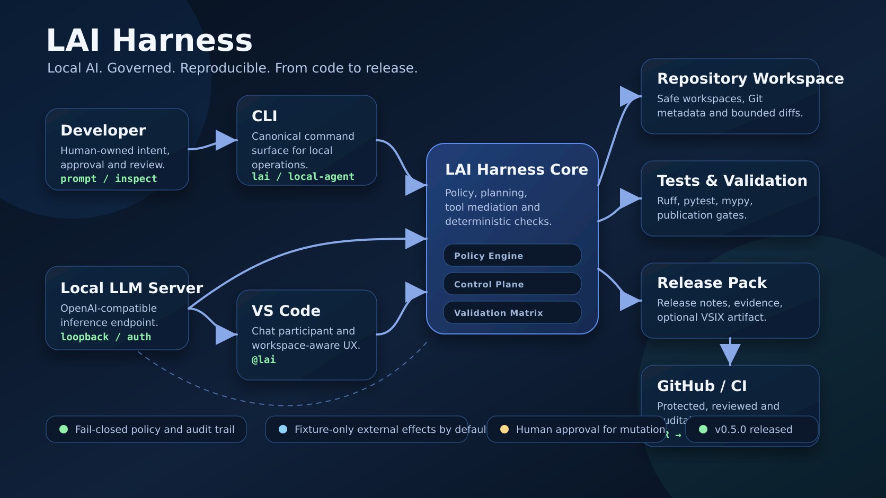
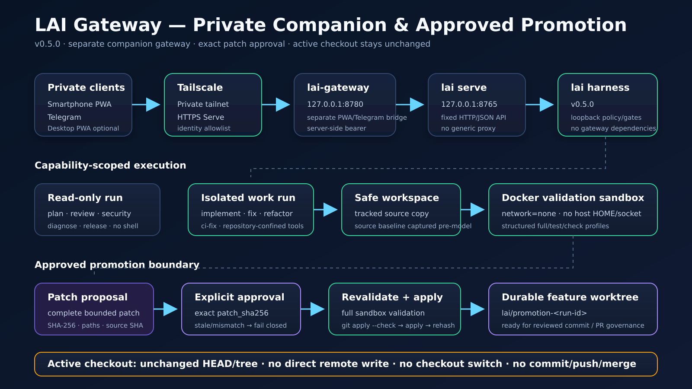
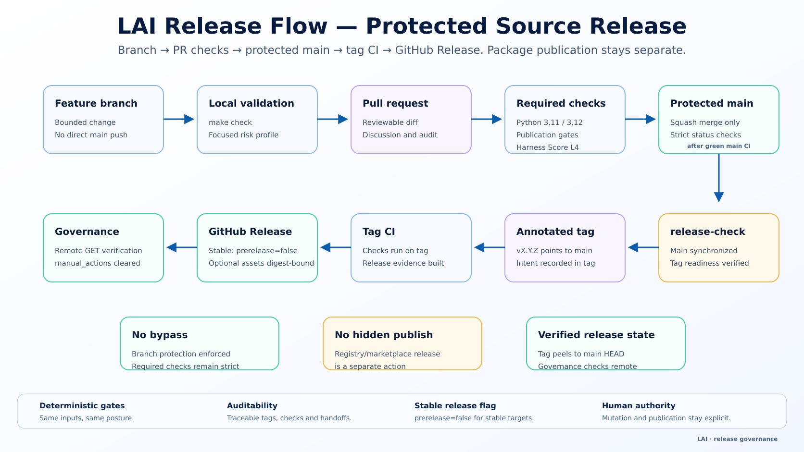

# lai harness

<p align="center">
  <strong>Local-first coding harness for small LLMs.</strong><br>
  Compact tools, deterministic policy, evidence gates, auditability, and protected release governance around local inference.
</p>

<p align="center">
  <a href="https://github.com/fenatodev/lai-harness/actions/workflows/ci.yml"></a>
  <a href="https://github.com/fenatodev/lai-harness/releases"></a>
  
  
  <a href="LICENSE"></a>
</p>

> **Current release:** `v0.4.0-beta.22` · experimental beta · Linux/WSL-first · local inference through an OpenAI-compatible endpoint such as llama.cpp.

lai harness makes constrained local models more useful by giving them a smaller, more deterministic operating environment. Instead of relying on a huge prompt and a generic shell, it combines mode-specific tools, repository-aware context, explicit policy decisions, validation gates, persistent state, and a release workflow that can be audited from feature branch to GitHub pre-release.

It complements high-context cloud agents rather than trying to replace them: local runs stay bounded and inexpensive, while `project-handoff` can carry verified context into another agent or future session.

## Project status

| Area | Current posture |
| --- | --- |
| Product version | `0.4.0-beta.22` |
| Harness maturity | L4 · Self-correcting · 100/108 (93%) |
| Runtime | Python standard library; no Python package dependencies in the harness |
| Primary surfaces | CLI (`lai`) + VS Code extension |
| Local model path | OpenAI-compatible HTTP; developed with llama.cpp + user-supplied GGUF |
| Remote control | Authenticated loopback control plane; isolated work runs plus hash-bound promotion into dedicated feature worktrees; no remote shell or direct active-checkout write |
| Release discipline | Protected `main`, required CI, annotated tag, tag CI, prerelease digest verification |

Harness Score is used as an external repository-maturity ratchet, not as a security certification.

## Why lai harness

Small local models have different constraints from frontier cloud models. Context is expensive, tool schemas compete with the task, repeated round-trips are slow, and an unconstrained shell is a poor default control surface.

lai harness is built around four ideas:

- **Reduce model overhead.** Mode-specific tools, bounded context, semantic subsystem hints, batch inspection, and transactional patching keep the model focused.
- **Make safety deterministic where possible.** `ALLOW` / `ASK` / `DENY` policy, hooks, protected-branch checks, release preflight, and explicit remote capability profiles run outside the model.
- **Turn failures into evidence.** Validation, acceptance, sanity, readiness, metrics, run history, checkpoints, and forensic audit records make state inspectable instead of implicit.
- **Treat release engineering as part of the harness.** A change is not “done” because the model says so; it must cross local gates, protected CI, synchronized `main`, tag CI, artifact verification, and governance checks.

## Architecture



The core stays deliberately local. The CLI and VS Code extension share the same policy/runtime, local inference remains under the user's control, and GitHub is used for protected integration and release evidence rather than as the execution boundary.

See [Architecture](docs/ARCHITECTURE.md), [Development harness](docs/DEVELOPMENT-HARNESS.md), [Security model](docs/SECURITY-MODEL.md), and [Semantic code contracts](docs/SEMANTIC-CODE-CONTRACTS.md).

## What is already implemented

### Agent loop and context

- compact mode-specific tool schemas and prompts;
- multi-file `inspect`, repository search/list/read tools, and transactional exact-replacement `patch`;
- deterministic semantic subsystem map with `lai semantics`;
- bounded context ranking with `lai context`;
- repository-local `.specs/` with stable `REQ-NNN` traceability and `lai spec`;
- persistent Git-aware handoff, checkpoints, explicit recovery, and drift-checked resume.

### Safety and validation

- centralized `ALLOW` / `ASK` / `DENY` policy;
- deterministic `lai policy-check` and repository shell-hook reuse;
- repository confinement and symlink checks for file mutations;
- isolated per-run workspaces for remote `implement` / `fix` / `refactor` / `ci-fix`;
- SHA-256-bound promotion proposals that revalidate work before creating a dedicated `lai/promotion-*` Git worktree/feature branch;
- structured `validate` profiles with Docker sandboxing for remote work and promotion revalidation;
- validation guard after writes and acceptance guard for requested test changes;
- evidence-driven debug/review/security modes and model-assisted post-patch sanity checks;
- development hooks, a strict mypy ratchet on typed guardrail modules, a generated development-sensor lock, and a separate Harness Score L4 CI ratchet.

### Observability and state

- versioned local JSONL metrics and forensic audit records with configurable bounded retention;
- deterministic `lai runs`, `lai run show`, `lai run last`, and sanitized `lai run export`;
- deterministic `lai readiness` environment/repository health checks;
- validated secret-safe configuration diagnostics with `lai config`;
- repeatable local model evaluation with `lai model run`, independent fixture validation, provenance, repeated sampling, and model-free planning/scoring;
- bounded update intelligence with `lai update`, official-source metadata, vulnerability evidence, upstream-change tracking, offline risk/urgency triage, and no automatic apply path.

### Release engineering

- focused `diagnose`, `ci-fix`, and `release` skills;
- deterministic `release-check`, `release-pack`, `release-governance`, and `project-handoff`;
- protected release flow that distinguishes feature integration, `ready_to_tag`, and `released` states;
- VSIX packaging plus release-asset digest verification;
- remote governance evidence separated from offline/local evidence.

## Quick start

Requirements: Python 3.11+, Git, ripgrep, VS Code with Chat Participant API support, and an authenticated OpenAI-compatible local model endpoint.

```bash
git clone https://github.com/fenatodev/lai-harness.git
cd lai-harness
./scripts/install-local.sh

mkdir -p ~/.config/lai
umask 077
python3 -c 'import secrets; print(secrets.token_urlsafe(32), end="")' \
  > ~/.config/lai/llama-api-key
```

Configure `~/.config/lai/config.toml`, `LAI_*` environment variables, or leading CLI flags. Precedence is `CLI > environment > TOML > defaults`.

```bash
lai doctor
lai readiness
lai config
lai semantics
```

Then open a Git repository in VS Code and try:

```text
@lai /plan add a focused regression test for the parser
@lai /diagnose explain why CI is failing
@lai /implement add the requested test and minimal fix
@lai /review review my current Git changes
```

Read [Installation](docs/INSTALLATION.md) and [Quick start](docs/QUICKSTART.md) before using write-capable modes.

## Modes

| Mode | Purpose | Writes files |
| --- | --- | --- |
| `/explain` | Explain current code/selection | No |
| `/plan` | Produce a grounded implementation plan | No |
| `/test` | Run and diagnose an existing check | No |
| `/debug` | Reproduce and trace a failure chain | No |
| `/diagnose` | Diagnose logs, environment drift, CI, or run state | No |
| `/review` | Review current code or Git changes | No |
| `/security` | Trace evidence-backed security findings | No |
| `/release` | Verify release readiness and produce operator evidence | No |
| `/fix` | Apply and validate a focused fix | Yes |
| `/ci-fix` | Repair a concrete CI/validation failure | Yes |
| `/refactor` | Make a behavior-preserving structural change | Yes |
| `/implement` | Complete explicit criteria and validate them | Yes |
| `/status` | Show workspace state | No |
| `/metrics` | Summarize recent measurements | No |
| `/audit` | Show the latest auditable run | No |
| `/handoff` | Show or annotate compact shared context | State only |
| `/clearcontext` | Clear persisted workspace context | State only |

Detailed contracts are in [Modes](docs/MODES.md).

## Local control plane and private mobile access

`lai serve` adds an authenticated loopback-only HTTP boundary for asynchronous control runs. Read-only modes remain shell-free; isolated `implement`, `fix`, `refactor`, and `ci-fix` runs write only to disposable safe workspaces and validate inside a constrained Docker sandbox. Beta.15 adds an explicit promotion boundary: only a successful work run with an unchanged clean source baseline can expose a SHA-256-bound proposal, and an approved hash is revalidated before the exact patch is applied to a dedicated `lai/promotion-*` feature worktree. The active source checkout remains unchanged. The control plane still does **not** expose a generic remote shell, commit, push, merge, release publication, or the llama.cpp port directly.

```bash
lai control-token init
lai serve --bind 127.0.0.1 --port 8765
```



The `lai-gateway` shown above is a **separate companion project**, not part of this repository or its runtime distribution. It is being developed to provide a private PWA/Telegram interface while keeping the LAI bearer token on the machine and the harness control plane on loopback.

See [Local control plane](docs/CONTROL-PLANE.md) and [Security model](docs/SECURITY-MODEL.md).

## Protected release flow



The release process is intentionally stricter than a normal local package build:

1. develop on a feature branch and pass local validation;
2. merge only through a reviewed PR with required checks;
3. synchronize a clean `main` and require `release-check` to report `ready_to_tag`;
4. create an annotated tag pointing at that exact `main` commit;
5. wait for tag CI and publication gates;
6. publish the frozen VSIX/release pack;
7. verify GitHub Release metadata, branch protection, and asset digest through remote governance;
8. require a converged project handoff with no remaining manual actions.

```bash
lai release-check --target 0.4.0-beta.22 --json
lai release-pack --target 0.4.0-beta.22 --with-vsix --json
lai release-governance --target 0.4.0-beta.22 --remote --json
lai project-handoff --target 0.4.0-beta.22 --remote --json
```

See [Release governance](docs/RELEASE-GOVERNANCE.md), [Release checklist](docs/RELEASE-CHECKLIST.md), and [Release notes](docs/RELEASE-NOTES.md).

## Security boundary

lai harness is **not a sandbox**. File tools are repository-confined and dedicated Git inspection is read-only, but allowed local `bash` still runs with the user's OS permissions. Command classification cannot enumerate every equivalent spelling, interpreter, or indirect effect.

Remote control is narrower by design. Read-only children receive shell-free inspection profiles. Work children receive repository-confined file tools plus structured `validate`, run in a disposable safe workspace, and return bounded evidence. Promotion is a separate deterministic action: the server binds approval to exact patch bytes, repeats `full` validation in the Docker sandbox, checks source SHA/branch/clean state, creates a dedicated feature worktree, applies with `git apply --check` + `git apply`, and verifies the resulting patch hash. The active checkout is not edited. Local `bash` outside control runs is still not an OS sandbox.

Use write-capable modes only in trusted, backed-up or disposable workspaces under a least-privilege account. Never commit API keys, control tokens, state, audit logs, model files, or real handoffs. Read [Security model](docs/SECURITY-MODEL.md) and [Safe workspaces](docs/SAFE-WORKSPACES.md).

## Documentation map

| Need | Start here |
| --- | --- |
| Install and configure | [Installation](docs/INSTALLATION.md) · [Configuration](docs/CONFIGURATION.md) · [Troubleshooting](docs/TROUBLESHOOTING.md) |
| Understand the architecture | [Architecture](docs/ARCHITECTURE.md) · [Development harness](docs/DEVELOPMENT-HARNESS.md) |
| Learn modes and context | [Modes](docs/MODES.md) · [Context intelligence](docs/CONTEXT-INTELLIGENCE.md) · [Semantic contracts](docs/SEMANTIC-CODE-CONTRACTS.md) |
| Inspect runs and recovery | [Run history](docs/RUN-HISTORY.md) · [Run export](docs/RUN-EXPORT.md) · [Runtime records](docs/RUNTIME-RECORDS.md) · [Recovery](docs/RECOVERY.md) |
| Track safe maintenance | [Update intelligence](docs/UPDATE-INTELLIGENCE.md) · [Model evaluation](docs/MODEL-EVALUATION.md) |
| Operate the control plane | [Control plane](docs/CONTROL-PLANE.md) · [Security model](docs/SECURITY-MODEL.md) |
| Release safely | [Beta readiness](docs/BETA-READINESS.md) · [Release preflight](docs/RELEASE-PREFLIGHT.md) · [Release governance](docs/RELEASE-GOVERNANCE.md) |
| Follow the project | [Roadmap](ROADMAP.md) · [Changelog](CHANGELOG.md) · [Development journey](docs/DEVELOPMENT-JOURNEY.md) |

## Experimental results

Historical synthetic fixtures on one development machine observed roughly 8–10 seconds for review, 17 seconds for planning, 22 seconds for debugging, and 32 seconds for implementation with sanity checking. One implementation fixture fell from about 14 API calls / 15 tool calls to about 5 API calls / 3 tool calls after batch-oriented changes.

These measurements are hardware-, model-, and fixture-specific. They document engineering direction, not universal performance promises. See [Benchmarks](docs/BENCHMARKS.md).

## Limitations

- Linux/WSL-first development workflow;
- local launcher examples assume llama.cpp, while the client only requires an OpenAI-compatible endpoint;
- model/prompt behavior varies substantially and can produce incorrect claims;
- local `bash` policy is governance, not OS containment;
- no automatic model installer or marketplace-distributed extension yet;
- runtime-record retention is local and tail-based rather than an archival database;
- approved remote work can promote only into a dedicated local feature worktree; commit, push, PR creation, merge, and protected-branch integration remain separate governed actions;
- remote work validation requires Docker plus the configured sandbox image to already exist locally; the harness never pulls it automatically.

## Visual documentation policy

Architecture diagrams are documentation aids; code, policy, tests, and the security model remain authoritative. `docs/assets/visual-assets.json` records the LAI version against which the diagrams were reviewed, and CI requires that marker to match the product version. Every version bump therefore forces an explicit visual review; diagrams are regenerated when architecture or release flow changes.

## Contributing

Focused issues, reproducible fixtures, security reports, and measured improvements are welcome. Read [CONTRIBUTING.md](CONTRIBUTING.md) and [SECURITY.md](SECURITY.md).

For write-capable dogfood, use a disposable workspace:

```bash
lai workspace create --name smoke
cd /tmp/lai-harness-workspaces/smoke
lai implement "make a small change and validate it"
git diff
```

## License and third parties

Original LAI code is released under the [MIT License](LICENSE). This repository does not license or redistribute VS Code, llama.cpp, Mistral/Ministral models, GGUF files, model templates, or other third-party components. Users obtain those separately under their respective terms. See [Third-party software](THIRD_PARTY.md).

---

<p align="center"><strong>Local AI. Governed. Reproducible. Auditable.</strong></p>
