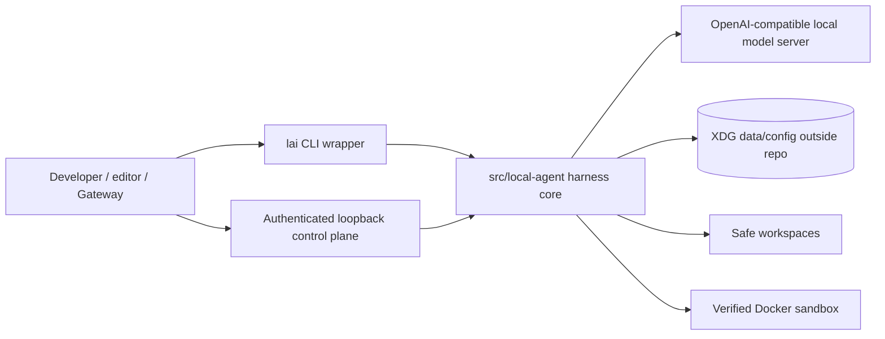
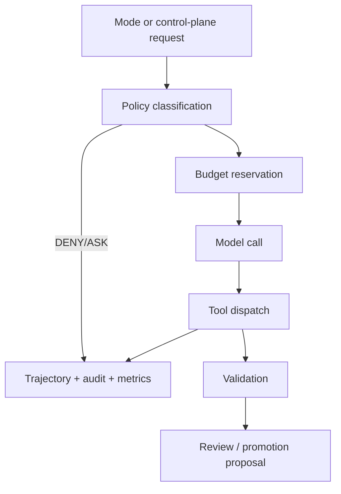

# lai harness architecture

`lai harness` is a local-first coding harness. The implementation is intentionally small in process topology: one primary runtime, one CLI wrapper, local state outside the repository, and optional companion surfaces that must negotiate explicit contracts.

## Design principles

1. Repository evidence outranks model output.
2. Deterministic guards outrank prompt instructions.
3. Capabilities are explicit and bounded.
4. Public views are metadata-only unless a user explicitly asks for file content through a safe path.
5. Roadmap documents are not implementation proof.

## Implemented system overview

SVG asset: [system overview](assets/diagrams/system-overview.svg).

## Runtime components

| Component | Path | Responsibility |
| --- | --- | --- |
| CLI wrapper | `src/lai` | Stable user-facing command and subcommand dispatch. |
| Harness core | `src/local-agent` | Agent loop, policy, tools, control plane, runtime state, records and most current features. |
| Configuration module | `src/lai_config.py` | XDG-aware configuration parsing and secret-safe status. |
| Semantic contracts | `src/lai_semantics.py` | Advisory subsystem map for navigation and ranking. |
| Spec workflow | `src/lai_specs.py` | Deterministic active-spec parsing and validation. |
| Sessions module | `src/lai_sessions.py` | Persistent session records and safe IDs. |
| Web evidence module | `src/lai_web.py` | Governed egress, public search/fetch receipts, local-service URL checks. |
| VS Code extension | `vscode-extension/` | Editor participant integration; it calls the installed harness. |

The monolithic core remains intentional for now. Extracted modules are strict-mypy ratchets around stable deterministic subsystems, not a separate runtime.

## Control plane and Gateway

`lai serve` starts an authenticated loopback HTTP API. It exposes status, readiness, sessions, runs, local-chat, review/promotion, authority, credentials, egress, browser fixture, MCP fixture, external-action fixture and delegate fixture routes. All protected routes require bearer authentication; local-chat POST routes also require CSRF.

The Gateway is a companion. It may render local-chat, activity, review and diagnostics, but it does not become the source of authority for filesystem, shell, Git, credentials or external effects.

See [Control plane](CONTROL-PLANE.md), [Gateway contract](GATEWAY-CONTRACT.md), and the [Gateway/local-chat diagram](assets/diagrams/gateway-local-chat.svg).

## Execution paths

Safe/read-only commands remain deterministic where possible. Model-backed modes receive bounded context and tool schemas. Work-runs execute inside safe workspaces and, for remote work, the verified sandbox executor.

See [Runtime execution](RUNTIME-EXECUTION.md) and [Observability](OBSERVABILITY.md).

## Authority model

Sensitive work flows through deterministic gates:

- policy classification returns ALLOW, ASK or DENY;
- approval intents are hash-bound, TTL-bound and use-once;
- credentials are represented by opaque refs and fake receipts in the current package;
- source checkout writes are not available through the control plane;
- promotion requires patch hash, source cleanliness and validation checks.

Approval records do not authorize arbitrary tool replay. See [Authority and approvals](AUTHORITY-APPROVALS.md).

## Sandbox boundary

The verified sandbox executor is used for work-runs and fixture execution. It requires a digest-pinned Docker image already present locally, uses `--pull=never`, no network, no Docker socket, non-root user, dropped capabilities, read-only root filesystem and bounded resources.

`sandbox_exec` is a work-run tool only. The generic remote profile does not expose host `bash` or arbitrary host shell execution.

See [Sandbox](SANDBOX.md) and [Safe workspaces](SAFE-WORKSPACES.md).

## External integrations

Current external-facing surfaces are deliberately constrained:

- Web evidence is GET-only, bounded, untrusted and receipt-producing.
- Browser is `fixture_browser` only; no login, personal profile, JS engine or public browser automation.
- MCP execution is `fixture_stdio` `write_artifact` only; generic MCP `call-tool` remains denied.
- External Git actions use `fake_git_remote` only; no real GitHub push, PR, merge, tag or release.

See [Web evidence](WEB-EVIDENCE.md), [MCP broker](MCP-BROKER.md), and [External boundaries](assets/diagrams/external-boundaries.svg).

## Data and records

Runtime state is stored outside the repository under XDG data/config locations unless overridden. Public status views are bounded and secret-free. Audit, metric, trajectory, budget, run-history, checkpoint and workspace records are versioned or migrated fail-closed where applicable.

See [Runtime records](RUNTIME-RECORDS.md), [Recovery](RECOVERY.md), and [Distribution](DISTRIBUTION.md).
