# Architecture diagrams

These diagrams describe implemented post-A12 behavior. They intentionally exclude A10 trusted-host and A11 computer-use drafts.

## System overview

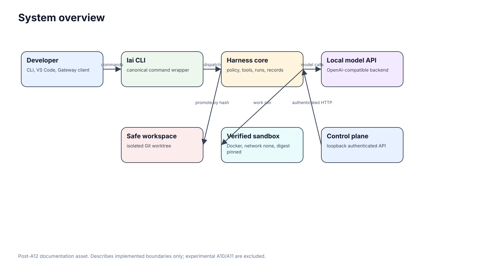

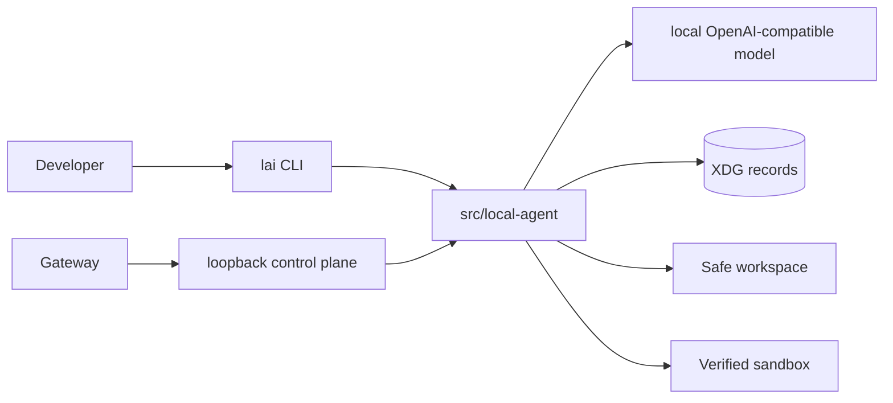

## Harness and Gateway

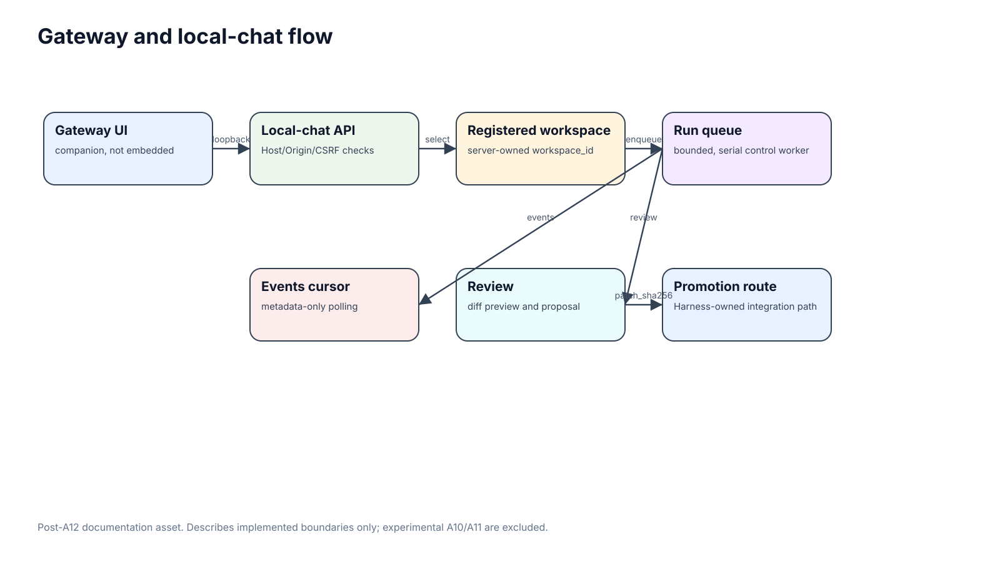

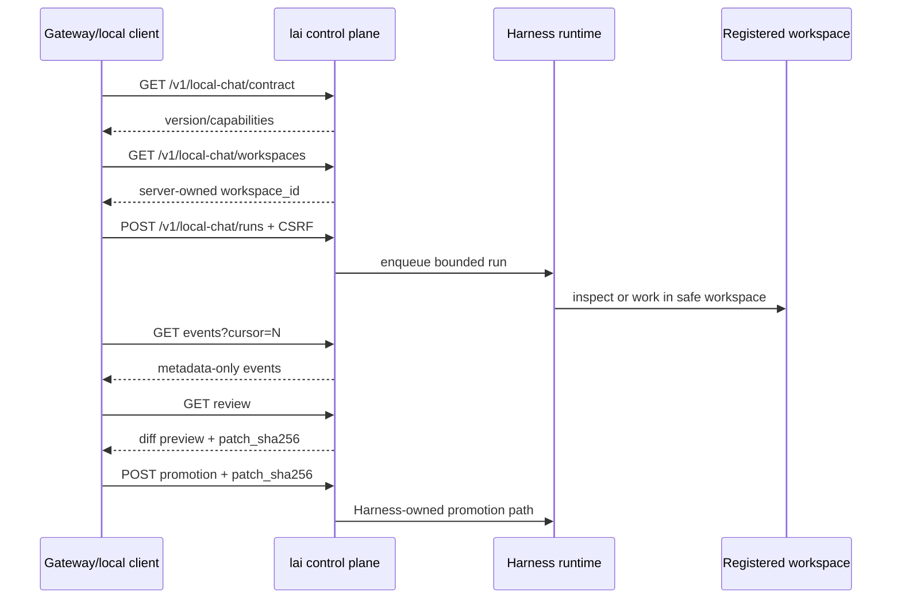

## Control plane

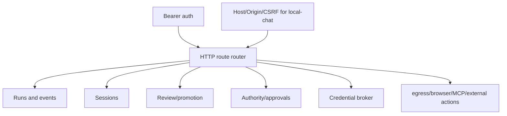

## Execution and security boundary

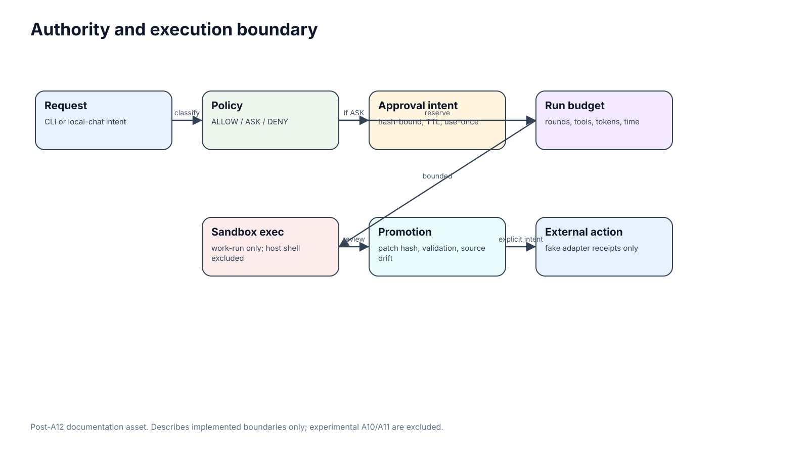

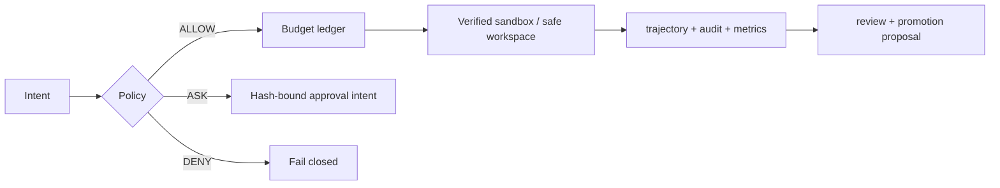

## Context intelligence and model lifecycle

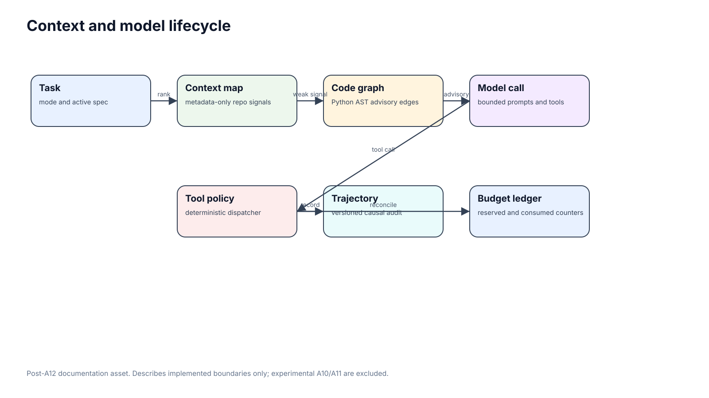

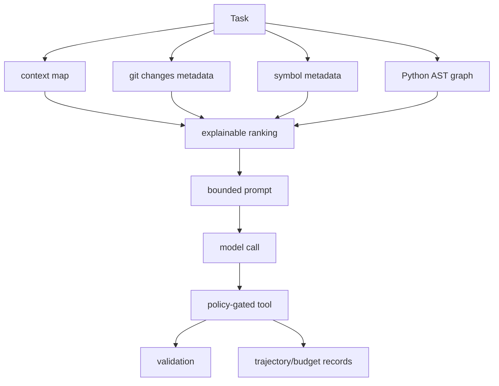

## MCP, browser, egress and external actions

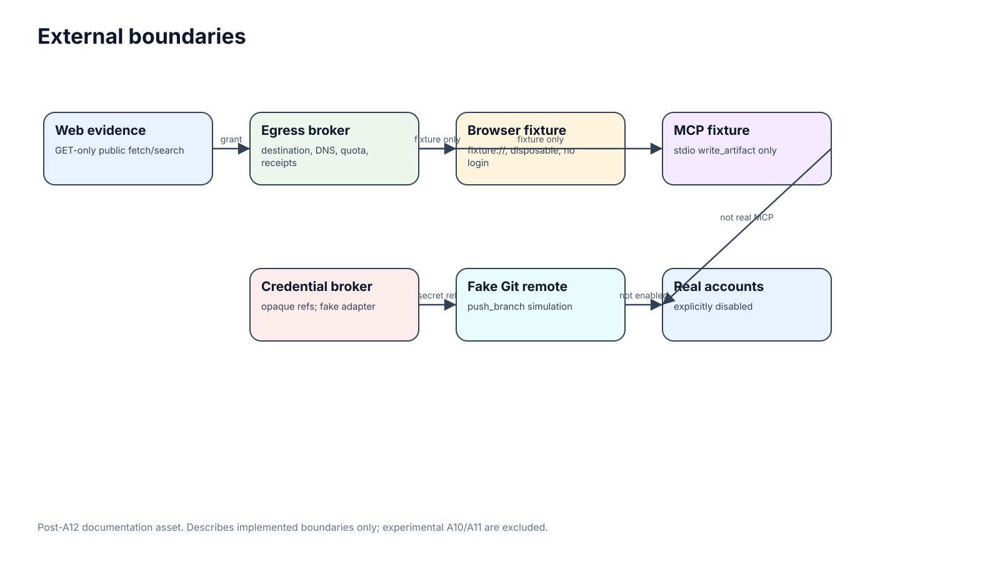

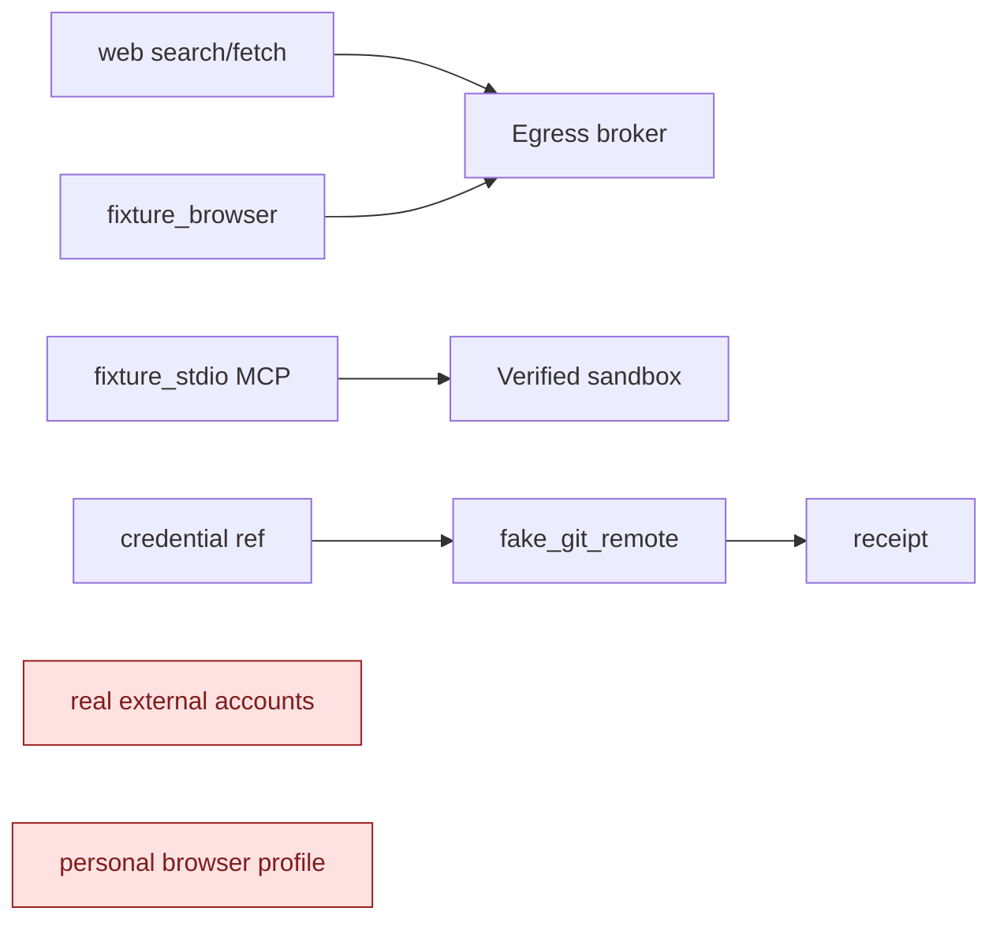

## Installation/runtime topology

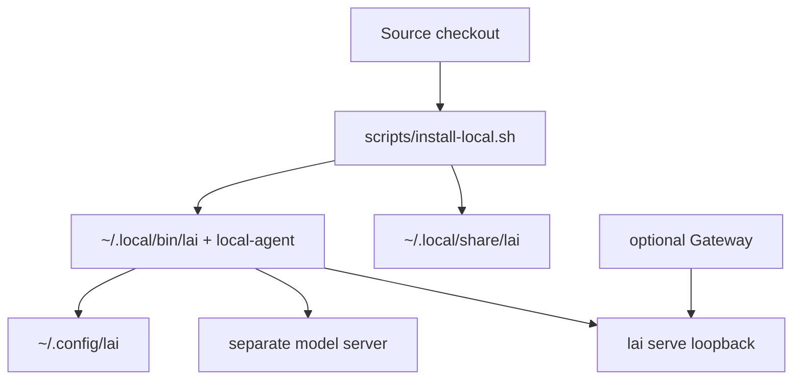

## Private companion boundary

SVG source: [private-mobile-access.svg](assets/private-mobile-access.svg).

This visual describes the companion `lai-gateway` path as a separate private transport around `lai serve`; it does not make PWA, Telegram or Tailscale part of the harness runtime. Promotion remains hash-bound and creates a durable feature worktree instead of changing the active checkout.

## Screenshots

CLI screenshots rendered from real sanitized command output are listed in [Screenshots](SCREENSHOTS.md).
