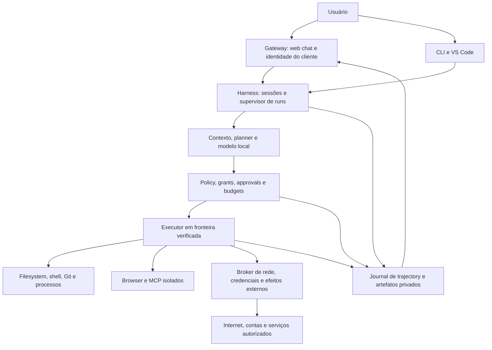

# lai harness arquitetura-alvo de autonomia

Proposta de 2026-09-08, não implementada. O [estado atual](ARCHITECTURE.md), o [plano](PROJECT-PLAN-2026-09.md), o [backlog](EXECUTION-BACKLOG-2026-09.md) e o [threat model](AUTONOMY-THREAT-MODEL.md) definem a migração. Linux/WSL2 é a primeira plataforma, confirmado pelo usuário; Windows nativo vem depois.

## Composição e responsabilidades

Policy é uma decisão anterior a cada ação, aplicada pelo supervisor e pela fronteira do OS. Credential/egress brokers mediam saídas; não são filtros colocados depois de um shell já autorizado com acesso irrestrito ao host. Modelo, planner, browser, skills e delegates não podem conceder autoridade.

| Componente | Dono | Reuso e evolução |
| --- | --- | --- |
| Sessões, runs, supervisor, policy e grants | Harness | Evoluir control plane e loop; extrair módulos somente ao implementar uma fatia testável |
| Context engine/planner/memória compacta | Harness | Ranking, specs e sessões existentes; planner explicita plano/estado, sem segundo LLM obrigatório |
| Chamadas/model profiles/router | Harness | Um cliente lógico e endpoint selecionado por run; aproveitar eval; Gateway não cria agente/modelo paralelo |
| Executor/sandbox/credential broker | Harness | Processos auxiliares com privilégio mínimo, fora do workspace; não novo serviço público |
| Chat, onboarding, histórico visual e client auth | Gateway | Reutilizar backend Python e assets estáticos; avaliar framework somente se a complexidade real exigir |
| Mobile/Telegram/transporte privado | Gateway | Projeções menores e capabilities próprias; não herdam permissões do usuário local |
| CLI/VS Code | Adapters do Harness | Permanecem úteis; convergir para os mesmos contratos, sem migração Big Bang |

Não criar um terceiro daemon de agente, banco vetorial, marketplace ou desktop nativo para entregar o primeiro chat. O Harness pode operar sem Gateway via CLI; Gateway deve detectar ausência de capabilities sem inventar endpoints. Os helpers de modelo já existentes no Gateway permanecem diagnósticos transitórios até convergir, sem exigir segundo modelo residente.

## Modelo formal de autoridade

Autonomia é independente do modo de tarefa (`plan`, `review`, `fix` etc.), do canal (CLI, local web, mobile) e do backend (host, container, VM). `plan` não passa a escrever por estar em Full. Os nomes dos três níveis são UX de presets, não valores novos já aceitos pela configuração atual.

Um **grant** proposto contém identidade do operador/canal, sessão/run/workspace, preset, capabilities, backend e prova de readiness, raízes de leitura/escrita, recursos protegidos, destinos/serviços de rede, referências de credenciais, classes de efeito externo, budgets, expiração, versão de policy e revogação. Sua representação persistida fica sob controle do supervisor, nunca em arquivo editável pelo projeto.

Autoridade efetiva = interseção entre concessão do usuário, policy obrigatória, restrições do modo/canal, controles verificáveis do backend e grant do pai. Um preset não é uma escala que sobrepõe um DENY; um grant de subagent sempre é subconjunto. Configuração de projeto, MCP, skill, memória, resposta de modelo ou checkpoint não pode ampliar essa interseção.

`ALLOW` executa somente dentro da interseção. `ASK` é uma operação potencialmente autorizável, ainda não executada. `DENY` cobre proibição, incapacidade de aplicar a fronteira e solicitação inválida. Uma aprovação não transforma backend incapaz em backend seguro. Concessões amplas para uma sessão evitam microaprovações internas; mudanças no grant exigem nova decisão do operador e registro.

| Dimensão | Safe | Autonomous Sandbox | Full / Trusted |
| --- | --- | --- | --- |
| Postura | Padrão de instalação/migração | Principal modo produtivo após opt-in para ambiente | Experimental e opt-in por ambiente/período |
| Fronteira | Tools confinadas; shell host atual explicitamente identificado como residual | Executor inteiro em container/VM verificado, cópia/clone independente | Conta/processos/recursos de host explícitos; controles reais do OS |
| Shell e processos | Tools estruturadas; shell limitado/ASK conforme policy | Bash amplo, scripts, build, servidores e término dos processos do run | Shell/PowerShell e aplicações do host somente nos escopos aplicáveis |
| Arquivos e exclusão | Projeto e guards existentes | Criação/edição/exclusão dentro de raízes graváveis, sem ASK por arquivo | Raízes do host escolhidas; protected paths têm precedência |
| Dependências | Postura existente até spec própria | Instalação no ambiente descartável, registry/grant e budgets; nunca instalador do host por acidente | Software do host por operação autorizada e privilégio mínimo |
| Git | Inspeção; mutações atuais continuam ASK | Commits/branches locais no repo independente; sem credenciais remotas | Git local do host escopado; efeitos remotos seguem broker |
| Rede/browser/MCP | Recursos restritos e allowlists | Execução útil nos destinos, runtimes e tools concedidos | Integrações ampliadas conforme grant; sem confiança automática |
| Contas e efeitos externos | ASK para classes críticas | Broker e aprovação específica ou grant limitado já autorizado | Mesma mediação onde tecnicamente aplicável; limite residual explícito |
| Cancelamento/limites | Budget e cancel do supervisor | Budget agregado e término da árvore/cgroup | Emergency stop da automação, não de todos os processos do usuário |

Protected paths incluem estado de autoridade, credenciais, journal, sockets de controle/modelo e áreas pessoais não concedidas. Não prometer proteção desses recursos quando se concede ao mesmo usuário do OS uma shell com acesso equivalente: essa combinação precisa conta/VM separada, controles adicionais ou permanecer indisponível como perfil protegido. Full não pode prometer confirmação universal de efeitos externos se permitir simultaneamente contas pessoais, rede irrestrita e shell do usuário.

## Supervisor e ciclo de execução

Estados propostos: queued, preparing, running, waiting_approval, pausing, paused, cancelling, succeeded, failed, cancelled, budget_exhausted e interrupted. Resultado de efeito externo tem estado independente, inclusive `outcome_unknown`. Pause é cooperativo em pontos seguros: não congela atomicamente uma requisição já enviada. Cancel é idempotente, impede novas reservas/ações, revoga grants filhos e termina processos rastreados, com evidência do que permaneceu incerto.

O supervisor confiável carrega grant, verifica boundary, reserva recursos, registra intenção, executa, registra resultado e reconcilia orçamento. Planejamento de alto nível é dado de sessão com revisões explícitas, não cadeia privada de raciocínio. Não transformar `src/local-agent` inteiro em uma nova arquitetura antes de uma capability precisar da extração.

ASK futuro conserva uma intenção imutável: action ID, ator, destino, payload/diff completo ou hash, precondições/baseline, scope, policy version, TTL e idempotency key quando suportada. A UI mostra a consequência concreta. Ao aprovar, o Harness revalida identidade, grant, tempo, estado e integridade imediatamente antes da ação. Replay, payload modificado, outro workspace ou policy nova invalidam a autorização. Aprovação de sessão cobre uma classe limitada de ações, nunca um curinga crítico escondido.

A promoção SHA-256 existente é a base desse contrato; não reusar checkpoints para replay. Checkpoints legados continuam sujeitos a drift e resume com novo run. Requests de controle e aprovações precisam ids deduplicáveis e recibos duráveis; após crash/timeout não repetir automaticamente e-mail, publicação, pagamento ou push de resultado incerto.

## Trajectory, artefatos e inspector

A1 cria um journal causal, append-only para o executor, sob o supervisor e fora da sandbox. Envelope proposto: schema version, sequence, event/action/span/parent IDs, sessão/run/workspace IDs opacos, timestamp UTC, duração monotônica, ator, tipo, status, reason code, policy/grant refs, consumo/reserva e artefact refs. Evoluir os readers de records v1 e export sem reescrever evidência histórica.

Eventos cobrem task aceita, preflight, contexto selecionado com provenance, revisão de plano, model call (inclusive verificadores/retries), tool/shell/process lifecycle, ALLOW/ASK/DENY, aprovação/revogação, diff/snapshot, validação, retry, budget, checkpoint, delegate e resultado. **Completude significa causalidade operacional**, não gravação de raciocínio interno do modelo nem dumps de segredos. Eventos atuais derivados do estado não ganham uma precisão que nunca registraram.

Persistência de intenção de ação crítica é pré-condição da execução: falha em journal obrigatório bloqueia nova ação. Perda de telemetria não crítica pode ser marcada explicitamente; nunca convertida em zero consumo. Artefatos volumosos usam referências com hash, tamanho, classificação, truncation/redaction e retenção. Um ledger de budgets/receipts não pode ser apagado pela retenção de logs durante um run ativo.

Duas projeções: local autenticada, com conteúdo relevante solicitado pelo usuário e previews sanitizados; remota/export, metadata allowlisted por padrão. Credenciais são excluídas de ambas. Shell/terminal é texto escapado e limitado; jamais usar stderr bruto como API. Screenshots, comandos e paths podem conter dados pessoais: coleta mínima e retenção explícita. Histórico não substitui inspeção dos arquivos atuais.

Começar com eventos incrementais consultados por cursor/sequence; SSE pode oferecer streaming unidirecional quando o contrato e auth estiverem prontos. Não exigir WebSocket/token streaming para o primeiro inspector. Reconexão deduplica IDs, detecta gaps e permite buscar snapshot sanitizado sem repetir ações. Persistência/retention deve ter fixtures de restart, disco cheio e log truncado.

## Budget Controller

Centralizar os limites dispersos sem remover os guards existentes. Contabilizar model calls (loop, verifier, síntese e retries), tool calls, shell launches, validation runs, retries, tokens de entrada/saída, contexto, duração, output/artifacts e recursos concorrentes. Filhos reservam no orçamento pai; não recebem um budget independente capaz de multiplicar o total.

Reserva atômica **antes** do dispatch; reconciliar consumo observado ao terminar; liberar somente reserva não consumida. Para tokens sem contagem confiável do provider, usar estimativa conservadora e teto de geração, registrando `estimated/unknown` em vez de zero. Clock monotônico para prazos; ao reiniciar, reconciliar ledger persistido e não zerar o budget do run retomado/fork sem concessão explícita.

Distinguir medição exata de chamadas conhecidas de limites OS: shell pode criar muitos subprocessos e requests invisíveis ao loop. CPU/memória/PIDs são aplicados por cgroups/backend; egress tem quotas no broker. Não prometer contagem exata de todos os HTTP requests de scripts arbitrários sem proxy/instrumentação obrigatórios. Backend que não aplica limite essencial fica indisponível para aquele perfil.

Ao atingir limite, impedir novas ações, terminar/cancelar conforme a classe e publicar stop reason, consumo e trabalho pendente. Guardar reserva de finalização para checkpoint/receipt/cancel, sem permitir nova atividade do modelo. Budgets variam por tarefa/preset e não implicam chamadas ilimitadas em Full.

## Sandbox e primitivas úteis

Primeiro backend: container Linux/WSL2, preferindo rootless quando readiness comprovar os limites. VM é alternativa para ameaça/privilégios que container não atende; não implementar Docker, Podman, VM e Windows Sandbox simultaneamente. Worktree serve para branches/promoção, não containment: partilha metadados Git. [Git worktree](https://git-scm.com/docs/git-worktree.html).

Rodar shell e processos de projeto dentro da fronteira, usando usuário não root, root filesystem read-only, writable overlays temporários, caps mínimas, no-new-privileges, limites CPU/memória/PIDs/disco/tempo, ambiente mínimo e mounts explícitos. Preparar imagem/toolchain por digest com provenance antes do run; nenhuma instalação silenciosa no host. O Docker atual de `validate` é reutilizável como aprendizado, mas usa imagem local mutable e mounts de runtime do host: não atende sozinho esse contrato.

O host supervisor conserva chaves, policy, journal, grant e controle. Não expor Docker socket, home, SSH agent, cloud metadata ou control/model tokens ao executor. Docker dentro de uma tarefa significa builder/daemon separado e governado; acesso direto ao daemon do host equivaleria a nova autoridade. Rootless exige provar cgroups/limites, não apenas detectar um binário. [Docker security](https://docs.docker.com/engine/security/), [rootless limitations](https://docs.docker.com/engine/security/rootless/tips/).

O workspace inicial é cópia/clone independente, com Git config/hooks locais verificados e sem `.git` compartilhado com o checkout fonte. Dependências instalam nesse ambiente por registries autorizados; cache não cruza trust domains sem controle. Scripts de instalação são execução de código não confiável. Git local pode commitar na branch isolada; push/merge/release são operações externas distintas. Promoção continua revalidando hash/drift e produzindo resultado revisável no lado confiável.

Primitivas propostas: shell session, filesystem, process spawn/poll/terminate, diff/validation e serviços locais registrados. Dev servers recebem porta/range, TTL, health e preview segregado; não bind público automático. A policy de shell não precisa compreender cada comando interno quando o OS aplica o grant. Se for preciso ler secret do host ou atravessar egress, a primitiva é insuficiente: solicitar capability mediada.

## Rede, credenciais e efeitos externos

Rede **é uma fronteira**, inclusive sem autenticação. Presets de egress: offline, registries selecionados, pesquisa pública, serviços locais registrados e contas/operações autenticadas. DNS/IPv6/redirects/proxies precisam enforcement no caminho real; bloquear metadata, LAN/loopback não concedidos e endpoints de autoridade. Allowlist de domínio não prova que dados privados não podem ser enviados para esse domínio.

Credential broker armazena referências opacas e integra secret stores/arquivos privados existentes. Sem criar vault/cloud próprio. O executor solicita operação autenticada de escopo limitado; broker injeta segredo somente no adapter necessário, fora do prompt/env genérico, e redige respostas antes de records/contexto/UI. TTL, audience/destino, menor escopo, revogação e receipt fazem parte da operação. Servidores que exigem secret em env só executam em processo dedicado explicitamente aprovado e isolado; documentar esse limite, sem fingir segredo inacessível ao servidor.

Começar com contrato e fake adapter; adicionar um adapter Git autenticado governado na spec 081 antes de generalizar GitHub/API/SSH/cloud/MCP/browser. Compras, pagamentos, publicação, comunicação externa e administração crítica mantêm aprovação específica ou operação tipada expressamente concedida. Não construir OAuth universal nem contas reais para validar fixtures. Idempotência reduz duplicação quando o serviço suporta; não promete execução exactly-once universal.

## Browser e computer use

Preservar `lai_web` como caminho leve para pesquisa pública sem browser. Browser automation é processo isolado com perfil descartável por trust domain, download em quarentena, sandbox do navegador ativa, cookies separados e screenshots limitadas. Contexts ajudam a separar sessões, mas storage state contém credenciais e o isolamento do browser não desfaz ações remotas. [Playwright Docker](https://playwright.dev/docs/docker), [authentication](https://playwright.dev/docs/auth).

Primeira entrega: navegar, pesquisar, extrair conteúdo, screenshot e testar aplicação local em fixtures. Depois: formulário/upload/download e conta dedicada mediante grant/broker. Página e DOM são não confiáveis; clicks/submits podem produzir efeitos e precisam de classificação conservadora. Para operação crítica, preferir adapter tipado com precondição/receipt a um clique visual ambíguo; se não for possível vincular intenção e efeito, handoff humano.

A UI do agente e o preview da aplicação usam origens e credenciais diferentes. Não reutilizar perfil pessoal nem permitir que página controle endpoints do Harness/Gateway. Browser network passa pelo mesmo egress; downloads não viram execução automática.

Computer use vem depois: desktop/VM dedicado com apps selecionadas, mouse/teclado/screenshot, captura mínima, allowlist de aplicações, stop externo ao modelo e confirmação de efeitos. PowerShell no host Windows exige backend nativo e testes próprios; o launcher PowerShell atual de modelo não constitui suporte de agente Windows. Desktop pessoal irrestrito permanece experimental.

## MCP executável

A7 supera o broker atual sem reinterpretar `list-tools` declarativo como execução existente. Primeira fatia: servidor stdio explicitamente selecionado e identidade/config/schema fixados por run, dentro do runtime autorizado, ambiente mínimo, limites de startup/call/output/processo e cancelamento. Um servidor fixture deve gerar/modificar um artefato útil dentro da sandbox: MCP precisa demonstrar valor além de replicar inspect.

Nenhum servidor é iniciado/instalado por simples presença em `.cursor/mcp.json` ou indicação do modelo. Tools recebidas têm nomes/schema/efeitos/capabilities mapeados por configuração confiável; descrições e annotations do servidor são evidência não confiável. Mudança de identidade/schema invalida grant. Callback, sampling, elicitation e nested operations ficam desabilitados até terem escopo/budget/policy próprios.

Depois adicionar HTTP autenticado, audiência correta e controle de destinos/redirects. Proibir token passthrough; o segredo Harness nunca é token MCP. Autorização HTTP e ambiente stdio têm modelos distintos. Fixar a revisão de protocolo e versões de SDK na spec de implementação a partir de evidência atual, sem usar um número futuro mencionado em documento antigo como prova. [MCP authorization](https://modelcontextprotocol.io/specification/2025-11-25/basic/authorization), [MCP transports](https://modelcontextprotocol.io/specification/2025-11-25/basic/transports).

Safe usa allowlists estreitas/ASK; Autonomous Sandbox permite tools de filesystem/processo da fronteira concedida; Full permite adapters adicionais com os mesmos controles possíveis. Timeout/redaction não significa que a tool não executou: receipt distingue tentativa, resultado bloqueado e efeito desconhecido.

## Interface e contrato entre projetos

Gateway entrega chat com sidebar de sessões, workspace/modelo/preset, plano, execução, tools, diffs/testes, budgets, ASK, cancel, pausa/continuação e histórico/checkpoints. Inspector abre detalhes sob demanda; a tela inicial é conversa e tarefa, não painel administrativo. Botões ainda sem capability ficam indisponíveis com motivo concreto.

Registro/seleção de workspace é autorizado server-side; não aceitar um path arbitrário enviado pelo browser como permissão. Uma sessão fica vinculada à identidade do workspace; trocar modelo não troca grant. Portas/daemons múltiplos por workspace ou registry de supervisor são decisões de implementação, após spec de contrato e fixtures de confusão entre projetos. Inicialmente pode haver um workspace servido por instância, com seleção apenas dos registrados.

O contrato v1 atual mantém `shell_execution=false` e `mcp_tool_execution=false`. Introduzir contrato versionado de execução (versão/revisão a escolher na spec) com capabilities por principal/canal/backend, não mudar silenciosamente esses flags. Harness antigo + Gateway novo: modo read-only suportado. Harness novo + Gateway antigo: v1 permanece ou incompatibilidade explícita, jamais autoridade implícita. Combinação incompatível desabilita execução preservando diagnóstico. Ter fixtures para as quatro combinações.

Auth local antes de qualquer mutação ampliada: sessão curta/revogável, bearer Harness server-side, Host/Origin allowlists, proteção CSRF, limites, escaping de Markdown/terminal, CSP e preview em outra origem. Loopback/CORS não substituem auth. Se cookies forem escolhidos, HttpOnly/SameSite e CSRF permanecem necessários; sem tokens em localStorage, service-worker caches ou logs. [OWASP CSRF](https://cheatsheetseries.owasp.org/cheatsheets/Cross-Site_Request_Forgery_Prevention_Cheat_Sheet.html).

Telegram/mobile continuam canais limitados por identidade/projeção. Nenhum botão remoto herda autorização Full do desktop. Remote approvals precisam spec de autenticação e conteúdo suficiente para revisão; ficam fora do primeiro chat local de escrita.

## Contexto, memória, modelos e skills

A5 amplia mapas/symbols em graph determinístico local: imports, definitions, referências resolvidas, classes/herança, module dependencies e relação teste→implementação. Python AST primeiro; JS/TS depois com parser avaliado por custo/licença, sem chamar regex atual de resolver. Call graph é parcial em linguagens dinâmicas: arestas levam origem, hash, resolução exata/heurística/unknown. Não afirmar completude.

Índice incremental opcional e descartável por root+commit/working hashes+versão de parser; symlinks/gerados/secrets excluídos; invalidação em edit/rename/delete. Consultas bounded retornam subgraph e evidência, não todo o repo. Fixtures cobrem aliases, ciclos, dynamic imports, renames e stale cache; medir descoberta/latência/correctness com modelo fixo. Embeddings só com hipótese e ganho local comprovado.

Memória conserva sessões compactas e handoff como evidência não confiável, com provenance, revisão/exclusão e orçamento; não criar aprendizagem autônoma que muda policy. Plano é resumo de intenção e progresso, não acesso a raciocínio privado.

A8 model profiles descrevem modelo+quantização, runtime/template/provider, hardware, fixture suite/version/repetições e capacidades: planning/coding/debug/tool calling/context/patch correctness/latency/refusal/truncation/hallucination/validation grounding. Seleção inicial manual. Router futuro usa resultados repetidos por classe, custo de carregamento e budget; nunca alterna para modelo cloud silenciosamente, faz download ou muda default por um benchmark. Falta de evidência mantém seleção atual e explicita unknown. Uma troca mantém histórico, grant e limites.

Skills declaram instruções, versão/origem, contexto, capabilities/tools requeridos, validação e saída esperada. Instalar skill não executa hooks nem concede permissões. Reutilizar `.agents/skills/<mode>/SKILL.md` e compatibilidade de `skills/*.txt`; manifest adicional só conforme a spec. Code plugin é executor não confiável, com lifecycle do runtime/MCP, não mero texto privilegiado. Marketplace fica deferred.

## Fork, comparação e delegates

Fork cria nova identidade, referência ao snapshot/base, cópia de contexto marcada histórica e workspace independente. Não copia grants ativos, tokens, approvals, processos ou efeitos externos. Grants filhos precisam autorização herdável explícita e budgets reservados no experimento pai; comparação controlada usa mesmo baseline, validações e recursos.

Comparar correctness/testes primeiro, depois patch, latency, chamadas, tokens e custo local/recursos. Artefatos separados; nenhum vencedor faz merge automático na fonte. Resultados não equivalentes ficam inconclusivos. Promoção reusa hash/drift e validação existentes.

Delegates começam após fork, grants, budget e boundary; graph/skills podem melhorar qualidade, sem ser dependências obrigatórias: decomposição explícita em DAG, waves determinísticas, contextos próprios, file ownership e máximo de paralelismo pequeno. Execução sequencial é fallback legítimo para um único modelo/VRAM limitada. Pai reserva recursos, define escopo e agrega respostas com evidência; detecta conflito de arquivos/contratos e reconcilia antes de integração. Erro de um filho não produz sucesso agregado. Cancelamento/revogação alcança toda árvore; subagent não negocia capacidade maior com outra superfície.

## Instalação, validação e evolução

Bootstrap mínimo em A4: instalar artefatos conhecidos → configurar endpoint/modelo já fornecido → doctor → abrir Gateway local → registrar projeto → chat Safe → optar por sandbox pronta. Reutilizar instaladores/doctors; reportar runtime/modelo único e capabilities indisponíveis, sem download de pesos ou fallback inseguro. A12 acrescenta upgrades, rollback de configuração compatível, uninstall que preserva dados por padrão e smoke em Linux/WSL2 limpos. Browser/runtime images são componentes opcionais provisionados explicitamente; core stdlib continua independente.

Validação acompanha risco conforme [development harness](DEVELOPMENT-HARNESS.md). Matriz Python mínima decorre de `tomllib`; testar piso e uma versão suportada com justificativa. Eliminar execução duplicada exige manter evidência equivalente e checks de proteção/release alinhados, na spec 080. Não prometer que a CI ou o installer já mudaram.

Rollback por milestone: desabilitar capability nova, preservar reader dos records compatíveis e retornar ao Safe, sem conceder escopo antigo por checkpoint. Arquivos podem ser restaurados por snapshots/hash/promoção; processos, pacotes e efeitos externos precisam descarte/compensação próprios. Cada milestone fecha com fixtures e stop rules do backlog, sem aguardar toda a visão para produzir valor.
